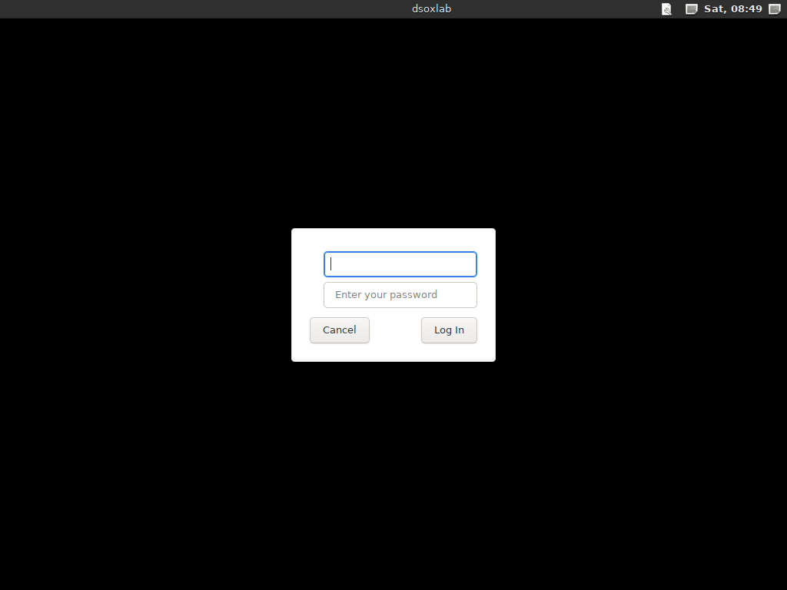

# L'appliance : une machine virtuelle prête à jouer

**Public :** qui travaille sous Windows ou macOS et veut jouer des labs sans
rien installer, et qui préfère une machine jetable à la sienne. **Aucune
connaissance de la virtualisation n'est supposée** : cette page va du
téléchargement au premier lab, étape par étape.

**Langue :** [English](./appliance.md) · [Français](./appliance.fr.md)

L'appliance est une machine virtuelle Debian 13 où dsoxlab, Ansible, Terraform
et un bureau sont déjà en place. On l'importe, on la démarre, on joue.


*L'appliance dans VirtualBox, quelques minutes après l'import : `dsoxlab
doctor` sur le bureau, 86 labs découverts, et le seul choix qui reste à faire —
l'hyperviseur — nommé avec la commande qui le règle.*

**Sous Linux, c'est la mauvaise réponse**, et cette page le dit franchement :
télécharger un demi-gigaoctet pour s'épargner `uv tool install dsoxlab` n'a
aucun sens. Elle existe pour les systèmes où cette commande n'est pas une
option.

---

## Ce qu'il vous faut

| | Minimum | Confortable |
| --- | --- | --- |
| Mémoire vive | 4 Go **libres** pour la VM | 8 Go, obligatoire pour les labs `vm` |
| Disque | 25 Go libres | 70 Go, si vous enchaînez plusieurs catalogues |
| Processeur | 2 cœurs | 4 cœurs |
| Logiciel | VirtualBox (gratuit) | — |
| Réseau | une connexion, le temps du premier démarrage | — |

Le premier démarrage télécharge environ 1,5 Go (dsoxlab, les hyperviseurs, le
bureau). C'est voulu : rien n'est figé dans l'image, donc rien n'y est périmé.

---

## Étape 1 — Installer VirtualBox

Rendez-vous sur <https://www.virtualbox.org/wiki/Downloads> et prenez le
paquet de votre système :

- **Windows** : *Windows hosts*. Double-cliquez, suivez l'assistant, acceptez
  l'installation des pilotes réseau quand Windows la demande.
- **macOS Intel** : *macOS / Intel hosts*. Après l'installation, macOS peut
  bloquer l'extension : ouvrez **Réglages Système → Confidentialité et
  sécurité**, puis *Autoriser* pour Oracle.
- **Linux** : votre gestionnaire de paquets, ou le paquet de la page.

L'*Extension Pack* proposé n'est **pas nécessaire** ici.

---

## Étape 2 — Télécharger l'image

Les images sont attachées aux [Releases du
projet](https://github.com/stephrobert/dsoxlab/releases), à **chaque** version
publiée. Autrement dit : prenez la dernière, il n'y a rien à vérifier.

| Fichier | Pour | Éprouvé |
| --- | --- | --- |
| `dsoxlab-appliance-<version>.ova` | VirtualBox — Windows, Linux, Mac Intel | oui : import, démarrage, bureau |
| la même `.ova` | VMware Workstation et Fusion | pas directement ; l'OVF valide contre le schéma DMTF et déclare ce que VMware attend |
| `dsoxlab-appliance-<version>.qcow2` | QEMU/KVM, libvirt, Proxmox | oui |
| `SHA256SUMS` | vérifier ce qu'on a téléchargé | — |

`<version>` est le numéro de la release, tel que la page des Releases
l'affiche sans son `v` : le fichier de la release `v0.2.3` s'appelle
`dsoxlab-appliance-0.2.3.ova`.

Si vous débutez, prenez le **`.ova`**.

**Vérifiez l'empreinte** avant d'importer un demi-gigaoctet venu d'Internet.
Téléchargez `SHA256SUMS` à côté de l'image, puis :

```powershell
# Windows, dans PowerShell
Get-FileHash .\dsoxlab-appliance-<version>.ova -Algorithm SHA256
```

```bash
# macOS et Linux
shasum -a 256 dsoxlab-appliance-<version>.ova
```

La valeur affichée doit être celle que `SHA256SUMS` donne pour ce fichier. Si
elle diffère, le téléchargement est incomplet ou altéré : recommencez-le.

Les deux images sont **x86-64**. Voir [Apple Silicon](#apple-silicon-m1-m4)
plus bas.

**Seuls les deux derniers jeux d'images sont conservés.** Les releases plus
anciennes gardent leur page, leur changelog et leurs distributions Python, mais
leurs `.ova` et `.qcow2` sont retirés — environ 900 Mo chacun, pour des images
qui n'épinglent aucune version de dsoxlab et installent la dernière au premier
démarrage. Une image ancienne n'offre donc rien d'autre que son poids.

---

## Étape 3 — Importer l'image

Dans VirtualBox : **Fichier → Importer un appareil virtuel**, choisissez le
fichier `.ova`, puis **Suivant**. Un double-clic sur le `.ova` ouvre la même
fenêtre.

L'écran suivant liste ce que la machine annonce : **4 processeurs** et
**8192 Mo** de mémoire. Ces valeurs sont modifiables ici même, et le moment est
bien choisi :

- votre machine a **8 Go de RAM au total** : descendez la VM à **4096 Mo**. Les
  labs `shell` fonctionneront, les labs `vm` non — `dsoxlab doctor` vous le dira
  au lieu de vous laisser deviner ;
- votre machine a **16 Go ou plus** : laissez 8192 Mo.

Cliquez sur **Terminer**. L'import dure une à trois minutes ; VirtualBox
décompresse le disque pendant ce temps.

---

## Étape 4 — Pour les labs `vm` : activer la virtualisation imbriquée

À sauter si vous ne visez que les labs `shell`.

Un lab de type `vm` démarre de vraies machines *dans* l'appliance. Il faut donc
que votre ordinateur autorise une machine virtuelle à en lancer d'autres, ce
qui se règle **en dehors** de l'appliance, celle-ci étant éteinte.

Dans VirtualBox, sélectionnez la machine, puis **Configuration → Système →
Processeur**, et cochez **Activer VT-x/AMD-V imbriqué**. En ligne de commande :

```bash
VBoxManage modifyvm "dsoxlab-appliance-<version>" --nested-hw-virt on
```

Si la case est grisée, votre processeur ou votre BIOS ne l'expose pas : les
labs `shell` restent entièrement jouables.

---

## Étape 5 — Démarrer, et laisser faire

Sélectionnez la machine et cliquez sur **Démarrer**. Ce que vous allez voir, en
trois temps, sans rien avoir à taper :

1. quelques secondes de texte blanc sur fond noir — le démarrage de Debian ;
2. **plusieurs minutes** où la machine semble attendre sur une invite de
   connexion. Elle ne dort pas : elle installe dsoxlab, les hyperviseurs et le
   bureau. Comptez cinq à quinze minutes selon votre connexion ;
3. la machine **redémarre d'elle-même**, et affiche l'écran de connexion.



Ce redémarrage n'est pas un incident : l'appartenance aux groupes et le bureau
ne prennent effet qu'au démarrage suivant.

**Si quelque chose échoue**, la machine le dit et **recommence au démarrage
suivant** : elle ne se marque jamais configurée à tort. La cause habituelle est
l'absence de réseau dans la machine virtuelle — vérifiez sa carte réseau dans
**Configuration → Réseau**, puis redémarrez-la.

---

## Étape 6 — Se connecter

| | |
| --- | --- |
| utilisateur | `student` |
| mot de passe | `dsoxlab` |

**La machine exige de changer ce mot de passe tout de suite.** C'est normal :
le mot de passe de construction est public, il est écrit dans ce dépôt. Elle
demande l'ancien (`dsoxlab`), puis le nouveau deux fois.

Vous arrivez sur un bureau XFCE. Le terminal est dans la barre du bas, deuxième
icône.

---

## Étape 7 — Jouer un premier lab

Dans le terminal :

```bash
dsoxlab demo                 # installe un catalogue de démonstration d'un lab
cd ~/.local/share/dsoxlab/demo

dsoxlab course premiers-pas     # la leçon
dsoxlab run premiers-pas        # vous dépose dans le répertoire de travail
dsoxlab challenge premiers-pas  # la mission
dsoxlab check premiers-pas      # les tests, et la note
```

Ce lab de démonstration ne demande ni VM ni conteneur : il vérifie que tout
fonctionne avant que vous n'investissiez dans un catalogue complet.

Ensuite, installez un vrai catalogue :

```bash
dsoxlab catalog add https://github.com/stephrobert/linux-dsoxlab-training
dsoxlab doctor                  # ce que cette machine peut faire, et ce qui manque
dsoxlab list-labs               # les 86 labs du catalogue
```

`doctor` vous dira s'il reste un choix à faire — par exemple l'hyperviseur,
quand le catalogue en propose plusieurs :

```bash
dsoxlab use --provider kvm
dsoxlab start <identifiant-du-lab>   # contexte, prérequis, infra, session
```


*`dsoxlab start` sur un lab `vm`, dans l'appliance : les seize contrôles requis
au vert, puis Terraform qui monte les trois machines du lab — des VM dans la
VM.*

---

## Si quelque chose ne va pas

| Symptôme | Cause la plus fréquente | Geste |
| --- | --- | --- |
| La machine reste sur une console, pas de bureau | le premier démarrage n'a pas abouti | il recommence au démarrage suivant : redémarrez la VM après avoir vérifié son réseau |
| L'invite de connexion s'affiche et rien ne semble se passer | la première configuration tourne en arrière-plan | tapez **Entrée** : l'invite affiche l'étape en cours. Depuis la 0.3.2, elle le dit d'elle-même |
| Le clavier est en QWERTY | images **jusqu'à la 0.3.1** | depuis la 0.3.2 l'image est en **AZERTY**. Sur une image antérieure : `sudo apt install console-setup keyboard-configuration && sudo dpkg-reconfigure keyboard-configuration` |
| « Temporary failure in name resolution » | la VM n'a pas de réseau | **Configuration → Réseau**, carte 1 activée en **NAT** |
| `dsoxlab doctor` dit qu'il manque la virtualisation imbriquée | elle s'active sur **votre** ordinateur, pas dans la VM | [étape 4](#étape-4--pour-les-labs-vm--activer-la-virtualisation-imbriquée), appliance éteinte |
| `doctor` dit « RAM : … disponibles pour … déclarés » | la VM est trop petite pour ce catalogue | augmentez sa mémoire, ou jouez les labs `shell` |
| L'import échoue sur une erreur d'OVF | téléchargement incomplet | revérifiez l'empreinte SHA256 |
| VMware refuse l'import : « SHA256 digest of file does not match manifest » | un défaut des images **jusqu'à la 0.2.5** — voir plus bas | prenez la 0.3.0 ou une version ultérieure, ou importez avec `ovftool --skipManifestCheck` |
| VMware dit que l'identifiant d'OS n'est pas supporté et le ramène à « Other (32-bit) » | les mêmes versions | le même correctif ; l'invité reste 64 bits, donc l'appliance fonctionne quand même |

**Sur l'empreinte du manifeste, pour les images jusqu'à la 0.2.5.** Un VMDK
`streamOptimized` se termine à un marqueur sur lequel son lecteur s'arrête ;
`qemu-img` laissait après ce marqueur une zone de zéros d'alignement, et
`ovftool` empreignait donc 64 512 octets de moins que ce que notre manifeste
déclarait. Le disque était intact : seules les deux lectures divergeaient.
Mesuré sur le fichier publié, corrigé en 0.3.0, et désormais contrôlé à la
construction — la fabrique refuse de livrer une image dont l'empreinte du fichier
n'est pas aussi celle de son flux.

Un rapport vaut mieux qu'un contournement : `dsoxlab support --issue` remplit
le diagnostic et ouvre l'issue au bon endroit.

---

## Apple Silicon (M1-M4)

**L'appliance ne tourne pas sur un Mac Apple Silicon**, et prétendre le
contraire coûterait un après-midi. Les deux images sont x86-64 ; Parallels,
VMware Fusion et UTM virtualisent de l'arm64 sur ces machines et n'émulent pas
une autre architecture à une vitesse utilisable. UTM sait émuler du x86-64 par
l'interpréteur de QEMU, à environ un dixième de la vitesse native : de quoi
regarder un démarrage, pas de quoi jouer un lab.

Une image arm64 est la réponse évidente, et elle est prévue plutôt que faite,
pour deux raisons qu'il vaut mieux connaître :

- les runners arm64 hébergés par GitHub **n'exposent pas `/dev/kvm`**, donc la
  CI devrait construire cette image en émulation, pendant des heures ;
- la virtualisation imbriquée sur Apple Silicon n'existe qu'à partir du **M3**
  avec macOS 15 ou plus récent. Même avec une image arm64, les labs `vm`
  resteraient donc hors de portée sur la plupart des Mac ; seuls les labs
  `shell` tourneraient.

En attendant, sur un Mac Apple Silicon, installez l'outil :
`uv tool install dsoxlab`. Tous les labs `shell` fonctionnent, c'est-à-dire
tout le catalogue Terraform et une bonne part des autres.

---

## Ce qu'il y a dedans

Debian 13, minimale, plus ce qu'un poste de lab demande : `git`, `curl`, `vim`,
`python3`, `man`, Ansible, Terraform, et après le premier démarrage dsoxlab, les
hyperviseurs et le bureau. La documentation et les locales autres qu'anglaise et
française sont exclues des paquets, ce qui fait l'essentiel du demi-gigaoctet
qu'on ne télécharge pas.

La recette vit dans [`packer/`](../packer/) et la CI la construit sur un runner
hébergé par GitHub. Elle est reproductible : rien n'est fait à la main dans
l'image.

## Limites connues

- **Un utilisateur, une machine.** L'appliance n'est pas un serveur de classe
  partagé ; un formateur qui sert plusieurs apprenants veut plutôt
  [la page du formateur](./trainer.fr.md).
- **Le disque déclare 64 Go, et il grossit chez vous.** Il est *fin* : le
  fichier téléchargé reste sous 500 Mo, et la place n'est prise sur votre hôte
  qu'au fur et à mesure. Vous n'avez donc rien à agrandir — le cluster Kubernetes
  à trois nœuds que 20 Go ne tenaient pas y entre —, mais prévoyez la place
  **libre** : un catalogue avec ses images de base et ses VM approche la
  trentaine de gigaoctets, deux la dépassent.
- **Aucune mise à jour automatique.** `uv tool upgrade dsoxlab` met l'outil à
  jour dans une appliance déjà installée. Réimporter une image plus récente
  n'apporte que le système mis à jour : dsoxlab, lui, s'installe à neuf au
  premier démarrage de chaque machine.

---

## Le clavier, et la langue

L'image arrive en **AZERTY français**, parce que la formation l'est. Les données
de disposition sont dans l'image : il n'y a rien à télécharger, et cela marche
dès la console, avant tout réseau.

Pour un autre clavier, une commande suffit :

```bash
sudo dpkg-reconfigure keyboard-configuration   # puis : sudo setupcon
```

**La locale du système reste l'anglais**, et c'est un choix : un message d'erreur
se cherche mot pour mot dans un moteur de recherche. C'est la même raison qui
fait écrire le journal de dsoxlab en anglais. `fr_FR.UTF-8` est tout de même
générée dans l'image, donc basculer ne demande pas de réinstaller :

```bash
sudo localectl set-locale LANG=fr_FR.UTF-8
```

Et pour l'interface de dsoxlab, indépendamment du système :

```bash
export DSOXLAB_LANG=fr        # ou en
```

---

## Suivre le premier démarrage

Il télécharge environ 1,5 Go et prend plusieurs minutes. Il ne bloque pas la
connexion : l'invite s'affiche pendant qu'il travaille.

Trois façons de savoir où il en est, de la plus simple à la plus précise :

1. **Tapez Entrée sur l'invite de connexion.** Elle affiche l'étape en cours —
   `getty` relit `/etc/issue` à chaque invite.
2. `journalctl -u dsoxlab-premier-demarrage -f` pour le suivre en direct.
3. `ls -l /var/lib/dsoxlab-premier-demarrage.fait` : ce marqueur n'existe
   **qu'après un succès complet**.

**Les trois signes qui disent que c'est fini** : la machine **redémarre d'elle-même**,
elle revient sur un **bureau** et non une console, et `dsoxlab --version` répond.

En cas d'échec, l'invite de connexion nomme les étapes manquées et rien n'est
perdu : tout recommence au démarrage suivant.

---

## L'assistant du premier démarrage

Au tout premier démarrage, **avant l'invite de connexion**, la machine pose
trois questions sur sa propre console :

```text
  Disposition du clavier

    * 1) Français (AZERTY)        2) Belge        3) Suisse romand
      4) Canadien français        5) US (QWERTY)  6) Allemand (QWERTZ)

  Votre choix [1] (30 s) :
```

Puis le **fuseau horaire** et la **langue de l'interface dsoxlab**.

Les menus sont numérotés à dessein : les chiffres sont au même endroit sur
toutes les dispositions, donc répondre « 2 » fonctionne quel que soit le clavier
que la machine croit avoir — ce qui est précisément le problème qu'on résout.

**Vous pouvez ne rien répondre.** Au bout de 30 secondes, la valeur marquée
d'une étoile est retenue : AZERTY, Europe/Paris, français. Un démarrage sans
personne devant l'écran n'est donc jamais bloqué, et `dsoxlab.oobe=0` ajouté à
la ligne de commande du noyau saute l'assistant entièrement.

Il ne se rejoue pas : son marqueur est `/var/lib/dsoxlab-assistant.fait`. Pour
le rejouer volontairement, retirez ce fichier et redémarrez.
