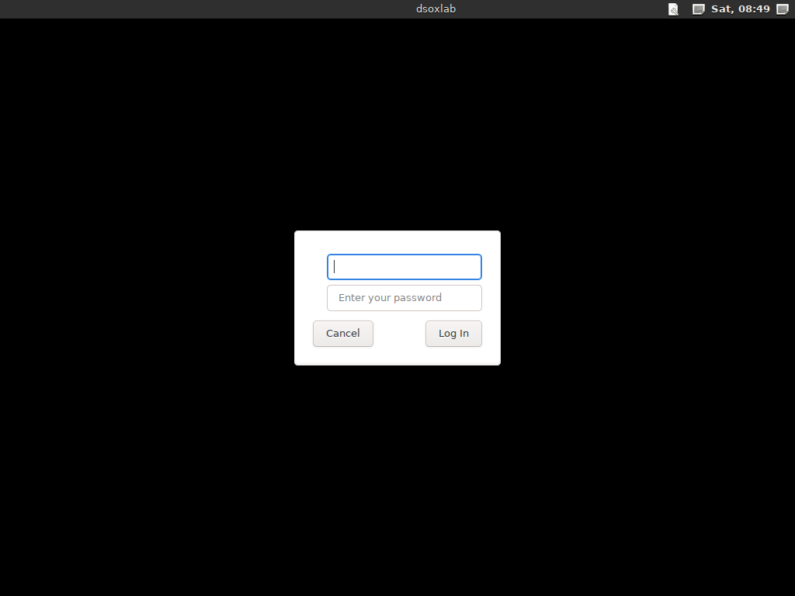

# The appliance: a ready-to-play virtual machine

**Audience:** anyone on Windows or macOS who wants to play labs without
installing anything, and anyone who prefers a throwaway machine to their own.
**No knowledge of virtualization is assumed**: this page goes from the download
to the first lab, step by step.

**Language:** [English](./appliance.md) · [Français](./appliance.fr.md)

The appliance is a Debian 13 virtual machine with dsoxlab, Ansible, Terraform
and a desktop already in place. You import it, you start it, you play.


*The appliance running in VirtualBox, a few minutes after import: `dsoxlab
doctor` on the desktop, 86 labs discovered, and the only choice left to make —
the hypervisor — named together with the command that settles it.*

**On Linux it is the wrong answer**, and this page says so plainly: downloading
half a gigabyte to avoid `uv tool install dsoxlab` makes no sense. It exists for
the systems where that command is not an option.

---

## What you need

| | Minimum | Comfortable |
| --- | --- | --- |
| Memory | 4 GB **free** for the VM | 8 GB, required for `vm` labs |
| Disk | 25 GB free | 40 GB |
| CPU | 2 cores | 4 cores |
| Software | VirtualBox (free) | — |
| Network | a connection, for the first boot | — |

The first boot downloads about 1.5 GB (dsoxlab, the hypervisors, the desktop).
That is deliberate: nothing is pinned in the image, so nothing in it is stale.

---

## Step 1 — Install VirtualBox

Go to <https://www.virtualbox.org/wiki/Downloads> and take the package for your
system:

- **Windows**: *Windows hosts*. Double-click, follow the wizard, and accept the
  network driver installation when Windows asks.
- **macOS Intel**: *macOS / Intel hosts*. After installing, macOS may block the
  extension: open **System Settings → Privacy & Security** and click *Allow*
  for Oracle.
- **Linux**: your package manager, or the package on that page.

The *Extension Pack* it offers is **not needed** here.

---

## Step 2 — Download the image

The images are attached to the [project's
Releases](https://github.com/stephrobert/dsoxlab/releases), on **every**
published version. Which means: take the latest, there is nothing to check.

| File | For | Tested |
| --- | --- | --- |
| `dsoxlab-appliance-<version>.ova` | VirtualBox — Windows, Linux, Intel Mac | yes: import, boot, desktop |
| the same `.ova` | VMware Workstation and Fusion | not directly; the OVF validates against the DMTF schema and declares what VMware expects |
| `dsoxlab-appliance-<version>.qcow2` | QEMU/KVM, libvirt, Proxmox | yes |
| `SHA256SUMS` | checking what you downloaded | — |

`<version>` is the release number, exactly as the Releases page shows it
without its `v`: the file on release `v0.2.3` is
`dsoxlab-appliance-0.2.3.ova`.

If you are starting out, take the **`.ova`**.

**Check the digest** before importing half a gigabyte from the internet.
Download `SHA256SUMS` next to the image, then:

```powershell
# Windows, in PowerShell
Get-FileHash .\dsoxlab-appliance-<version>.ova -Algorithm SHA256
```

```bash
# macOS and Linux
shasum -a 256 dsoxlab-appliance-<version>.ova
```

The value printed must match the one `SHA256SUMS` gives for that file. If it
differs, the download is incomplete or tampered with: start it again.

Both images are **x86-64**. See [Apple Silicon](#apple-silicon-m1-m4) below.

**Only the last two sets of images are kept.** Older releases keep their page,
their changelog and their Python distributions, but their `.ova` and `.qcow2`
are removed — roughly 900 MB each, for images that pin no dsoxlab version and
install the latest at first boot. An old image offers nothing but its weight.

---

## Step 3 — Import the image

In VirtualBox: **File → Import Appliance**, pick the `.ova` file, then
**Next**. Double-clicking the `.ova` opens the same window.

The next screen lists what the machine advertises: **4 CPUs** and **8192 MB**
of memory. Both can be changed right here, and this is the moment to do it:

- your machine has **8 GB of RAM in total**: bring the VM down to **4096 MB**.
  `shell` labs will work, `vm` labs will not — and `dsoxlab doctor` will say so
  rather than leave you guessing;
- your machine has **16 GB or more**: leave 8192 MB.

Click **Finish**. The import takes one to three minutes, while VirtualBox
decompresses the disk.

---

## Step 4 — For `vm` labs: enable nested virtualization

Skip this if you only want `shell` labs.

A `vm` lab starts real machines *inside* the appliance. Your computer therefore
has to allow a virtual machine to launch others, which is set **outside** the
appliance, with it powered off.

In VirtualBox, select the machine, then **Settings → System → Processor**, and
tick **Enable Nested VT-x/AMD-V**. On the command line:

```bash
VBoxManage modifyvm "dsoxlab-appliance-<version>" --nested-hw-virt on
```

If the box is greyed out, your CPU or your BIOS does not expose it: `shell`
labs remain entirely playable.

---

## Step 5 — Start it, and let it work

Select the machine and click **Start**. Here is what you will see, in three
acts, with nothing to type:

1. a few seconds of white text on black — Debian booting;
2. **several minutes** where the machine appears to sit at a login prompt. It
   is not idle: it is installing dsoxlab, the hypervisors and the desktop.
   Count five to fifteen minutes depending on your connection;
3. the machine **reboots on its own** and shows the login screen.



That reboot is not a failure: group membership and the desktop only take effect
at the next boot.

**If something fails**, the machine says so and **starts over at the next
boot**: it never marks itself configured when it is not. The usual cause is no
network in the virtual machine — check its adapter under **Settings →
Network**, then restart it.

---

## Step 6 — Log in

| | |
| --- | --- |
| user | `student` |
| password | `dsoxlab` |

**The machine requires you to change that password immediately.** That is
expected: the build password is public, it is written in this repository. It
asks for the old one (`dsoxlab`), then the new one twice.

You land on an XFCE desktop. The terminal is in the bottom bar, second icon.

---

## Step 7 — Play a first lab

In the terminal:

```bash
dsoxlab demo                 # installs a one-lab demonstration catalog
cd ~/.local/share/dsoxlab/demo

dsoxlab course premiers-pas     # the lesson
dsoxlab run premiers-pas        # drops you into the lab's work directory
dsoxlab challenge premiers-pas  # the mission
dsoxlab check premiers-pas      # the tests, and the score
```

That demonstration lab needs no VM and no container: it proves the whole loop
works before you invest in a full catalog.

Then install a real catalog:

```bash
dsoxlab catalog add https://github.com/stephrobert/linux-dsoxlab-training
dsoxlab doctor                  # what this machine can do, and what is missing
dsoxlab list-labs               # the catalog's 86 labs
```

`doctor` will tell you whether a choice is still pending — the hypervisor, for
instance, when the catalog offers several:

```bash
dsoxlab use --provider kvm
dsoxlab start <lab-id>          # context, prerequisites, infrastructure, session
```


*`dsoxlab start` on a `vm` lab, inside the appliance: sixteen required checks
green, then Terraform bringing up the lab's three machines — VMs inside the
VM.*

---

## When something goes wrong

| Symptom | Most likely cause | What to do |
| --- | --- | --- |
| The machine stays on a console, no desktop | the first boot did not complete | it starts over at the next boot: check the VM's network, then restart it |
| "Temporary failure in name resolution" | the VM has no network | **Settings → Network**, adapter 1 enabled, attached to **NAT** |
| `dsoxlab doctor` reports missing nested virtualization | it is enabled on **your** computer, not inside the VM | [step 4](#step-4--for-vm-labs-enable-nested-virtualization), appliance powered off |
| `doctor` says "RAM: … available for … declared" | the VM is too small for this catalog | give it more memory, or play `shell` labs |
| The import fails on an OVF error | incomplete download | check the SHA256 digest again |

A report beats a workaround: `dsoxlab support --issue` fills in the diagnosis
and opens the issue in the right place.

---

## Apple Silicon (M1-M4)

**The appliance does not run on an Apple Silicon Mac**, and saying otherwise
would waste your afternoon. Both images are x86-64; Parallels, VMware Fusion
and UTM virtualize arm64 on these machines and do not emulate another
architecture at a usable speed. UTM can emulate x86-64 through QEMU's
interpreter, at roughly a tenth of native speed — enough to watch a boot, not
to play a lab.

An arm64 image is the obvious answer, and it is planned rather than done, for
two reasons worth knowing:

- GitHub's hosted arm64 runners **do not expose `/dev/kvm`**, so the CI would
  have to build that image under emulation, for hours.
- Nested virtualization on Apple Silicon only exists from the **M3** with macOS
  15 or later. So even with an arm64 image, `vm` labs would stay out of reach
  on most Macs; only `shell` labs would run.

Until then, on an Apple Silicon Mac, install the tool:
`uv tool install dsoxlab`. Every `shell` lab works, which is the whole
Terraform catalog and a good part of the others.

---

## What is inside

Debian 13, minimal, plus what a lab workstation needs: `git`, `curl`, `vim`,
`python3`, `man`, Ansible, Terraform, and after the first boot dsoxlab, the
hypervisors and the desktop. Documentation and locales other than English and
French are excluded from the packages, which is most of what keeps the image
under half a gigabyte.

The recipe is in [`packer/`](../packer/), built by the CI on a GitHub-hosted
runner. It is reproducible: nothing is hand-made in the image.

## Known limits

- **One user, one machine.** The appliance is not a shared classroom server; a
  trainer serving several learners wants [the trainer's page](./trainer.md).
- **The disk is 20 GB.** Enough for a catalog and a few lab VMs, not for a
  Kubernetes cluster of three nodes. Enlarge it in your hypervisor if needed.
- **No automatic update.** `uv tool upgrade dsoxlab` updates the tool inside an
  appliance you already run. Importing a newer image only brings you an updated
  system: dsoxlab itself is installed fresh at every machine's first boot.
